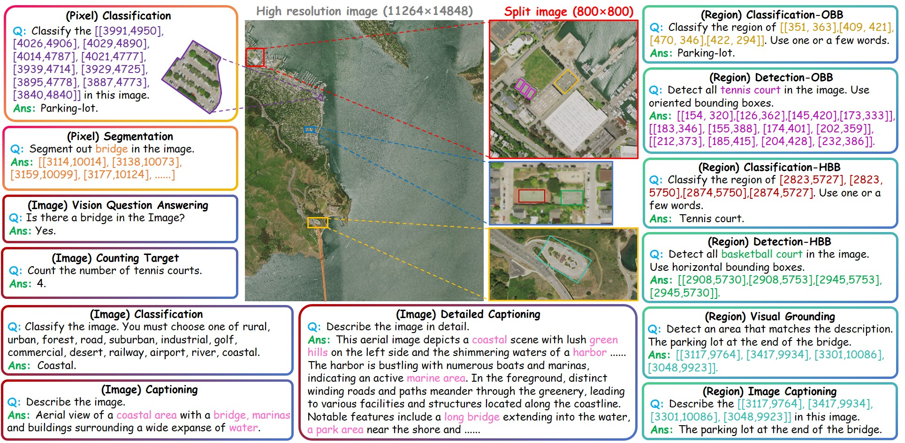

Official Repository for RS-M3Bench: A Multi-Granularity, Multi-Task, Multi-Resolution Benchmark for Scalable Evaluation of Remote Sensing Vision-Language Models

==================
<a href='https://huggingface.co/datasets/xiang709/VRSBench'>

    3Bench provides a unified platform for evaluating remote sensing vision-language models across 13 tasks, from fine-grained segmentation to large-scale VQA.">

The rise of remote sensing vision-language models (RS-VLMs) has revolutionized geospatial analysis, yet their evaluation remains shackled to outdated benchmarks that fail to capture their full-spectrum capabilities. We present RS-M$^3$Bench, the first unified benchmark for multi-granularity, multi-task, multi-resolution evaluation of RS-VLMs, shattering the limitations of existing frameworks. By integrating pixel-precise masks (from SATLAS-pretrain), richly structured scene graphs (from STAR and ReCon1M with 120+ subcategories), and multi-resolution imagery (800$\times$800–10,000$\times$10,000 pixels), RS-M$^3$Bench delivers 6.5M annotations—surpassing all current benchmarks combined—enabling exhaustive assessment across 13 tasks, from fine-grained segmentation to large-scale VQA. Unlike prior works, our benchmark forces models to demonstrate true geospatial reasoning, with GPT-4V generations and SAM-enhanced masks ensuring pixel-level accuracy and scene-level context coexist. Experiments reveal stark capability gaps in cutting-edge RS-VLMs and general-purpose VLMs, proving existing VLMs systematically overestimate real-world readiness. RS-M$^3$Bench  establishes a solid foundation for scalable, rigorous, and actionable RS-VLM benchmarking. 

See https://huggingface.co/datasets/RemoteReason-JLU/RS-M3Bench yo get access to our dataset!

See https://github.com/minglangL/RS-M3Bench for detailed evaluation codes.
